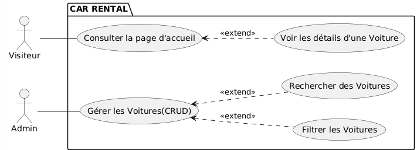
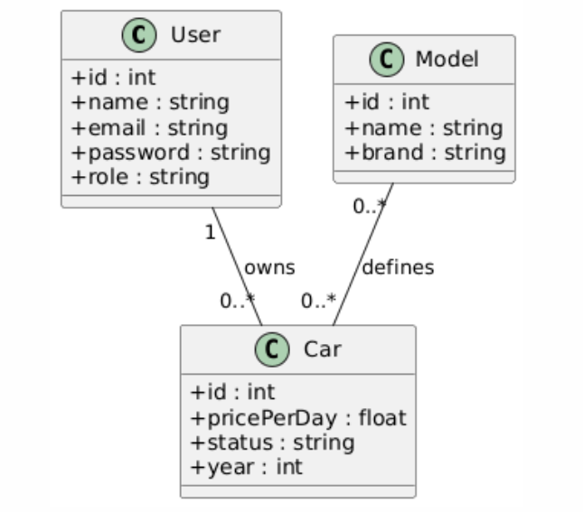

# Car Rental System  
### Vehicle rental management application

## Devlopped By : Ayman el Achiri
## Supervised By : M. Fouad Essarraj
## Date : 05/01/2026 

---

## Context – Car Rental System

The **Car Rental System** is a web application designed to manage rental cars and allow users to search and filter vehicles based on different criteria such as **model**, **brand**, and **availability**.

---

## Project Objectives

- Understand the **generic design** of a CRUD application  
- Separate **functional requirements** from **technical implementation**  
- Practice CRUD operations:
  - Create
  - Read
  - Update
  - Delete
- Apply a **structured methodology (2TUP)**

---

## Technical Requirements – Analysis

### Technologies Used

1. **Database**: MySQL  
2. **Architecture**: N-Tiers  
3. **Framework**: Laravel  
4. **Design Pattern**: MVC  
5. **Template Engine**: Blade  
---
6. **AJAX**: Dynamic search without page reload  
7. **Image Upload**: Car images management  
8. **Multi-language**: Laravel localization  
9. **Vite**: Modern build tool  
10. **Preline UI**: UI components  
11. **Tailwind CSS**: Utility-first CSS framework  

---

## Functional Analysis

The application is based on two main actors:

- **Visitor (Client)**
- **Administrator**

---

## Actor: Visitor (Client)

The visitor can:

- View available cars
- Search cars by **model**
- Filter cars by:
  - Brand
  - Price per day
  - Availability
- View car details
- Navigate results with pagination

---

## Actor: Administrator (Admin)

The administrator can:

- Add a new car
- Edit car information
- Delete a car
- Upload car images
- Manage availability
- Search and filter cars by model

---

## System Design – Class Diagram

---
## Live Coding Topic
  - Un bouton “Ajouter” qui ouvre une modale pour créer un nouvel élément.
  - submission de formulaire avec ajax
  - Une barre de recherche filtrant des voiture par model.
---
### Feature: Search / Filter Cars by Model

- A search input field to filter cars by **model**
- Real-time filtering using **AJAX**
- Results update without page reload
- Pagination applied to filtered results

---

## Conclusion

The **Car Rental System** provides an efficient way to manage rental vehicles and offers users a smooth experience through dynamic search and filtering features.

